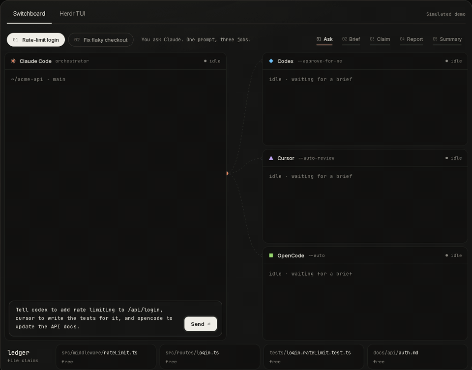

# Agent Cowork Memory (ACM)

```
 █████╗  ██████╗███╗   ███╗
██╔══██╗██╔════╝████╗ ████║
███████║██║     ██╔████╔██║
██╔══██║██║     ██║╚██╔╝██║
██║  ██║╚██████╗██║ ╚═╝ ██║
╚═╝  ╚═╝ ╚═════╝╚═╝     ╚═╝
```

Hit your Codex limit mid-task? Open Cursor, say **"continue from Codex"**, and keep going. ACM gives Codex, Claude Code, Cursor, and OpenCode one shared memory, so you never paste context again, and any agent can put the others to work.


 Codex  ·   Claude Code  ·   Cursor  ·   OpenCode

## Demo



More demos on the [ACM official site](https://acm-website-sand.vercel.app/)

## Install

With [Node 24](https://nodejs.org) or newer:

```sh
npx agent-cowork-memory setup
```

Setup adds ACM to Cursor, and to Codex, Claude Code, and OpenCode when they are installed; Installed one later? Run setup again. Restart your agents, and ACM is available in every project.

Tested for real on Linux and WSL. macOS and Windows pass CI; real runs welcome.

## Use

### Memory Sharing

Open the same project in Codex and Cursor. To pick up a chat in the other agent, ask:

> Use ACM to continue from Cursor.

Or, in Cursor:

> Use ACM to continue from Codex.

Every agent can see every chat in the project. If there is more than one, the agent lists them (agent, time, thread, first message, and whether ACM started it for a delegated job) and asks you which one to continue. You can also name it:

> Use ACM to continue the Codex chat about the trip.

Related work goes together in a **thread**: continuing a chat, or delegating from it, keeps the work on one thread, and a new chat can join one of the project's open threads. ACM keeps each thread's timeline as things happen (chats joining, jobs starting and finishing, notes added), so any agent can see where the work stands.

Ask your agent to remember a decision, and every agent in the project sees it. Notes stay true.

### Delegate to other agents

Any agent can hand work to the others:

> Tell codex to write plan.md, and claude to write packing.md.

Each agent gets a brief, joins the thread it was sent from, claims the files it edits so they don't collide, and reports back. Agents run in the background. With [herdr](https://herdr.dev) installed, each one gets its own pane you can watch (`herdr session attach acm`).

## MCP tools

| Tool              | What it does                                                                                                                                                                                                                                                                                               |
| ----------------- | ---------------------------------------------------------------------------------------------------------------------------------------------------------------------------------------------------------------------------------------------------------------------------------------------------------- |
| `context`       | Your thread and its timeline, the project's notes (after the first call, only what's new), open threads, recent jobs, who is working, and held files. Pass `hold` to claim files before writing, `thread` to join one, `done` to close yours. `stale` lists notes whose files changed, to re-check. |
| `note_add`      | Saves a note every agent sees, and shows notes it may contradict. `tier`: `short` (default, kept 7 days) or `long`; `supersedes`: the note it replaces.                                                                                                                                             |
| `note_search`   | Finds notes and delegated jobs' results.                                                                                                                                                                                                                                                                   |
| `chats`         | Lists recent chats from every agent in the project, and marks the ones ACM started.                                                                                                                                                                                                                        |
| `resume`        | Asks you which chat to continue when there are several, then reads it and joins its thread.                                                                                                                                                                                                                |
| `delegate`      | Starts other agents with a brief, in herdr panes or in the background, and waits for them.                                                                                                                                                                                                                 |
| `delegate_wait` | Keeps waiting on this chat's delegated agents.                                                                                                                                                                                                                                                             |

ACM tells which chat it is in on its own; no tool needs a session or, from the project folder, a path (every tool takes an optional `repo_path`).

## CLI

| Command                                                         | What it does                                                                 |
| --------------------------------------------------------------- | ---------------------------------------------------------------------------- |
| `acm setup`                                                   | Adds ACM to your agents.                                                     |
| `acm mcp --harness <agent>`                                   | Runs the MCP server; agents start it themselves.                             |
| `acm status [--repo <dir>] [--chat <id>] [--harness <agent>]` | The project's jobs, held files, and a chat's thread, as JSON.                |
| `acm doctor`                                                  | Checks the install: Node, the database, herdr, and which agents are on PATH. |
| `acm backup [--to <file>]`                                    | Copies the database.                                                         |

`--home <dir>` (or `ACM_HOME`) moves ACM's state folder from `~/.agent-cowork-memory`. Run them with `npx -y agent-cowork-memory <command>`, or `acm` once it's installed globally.
